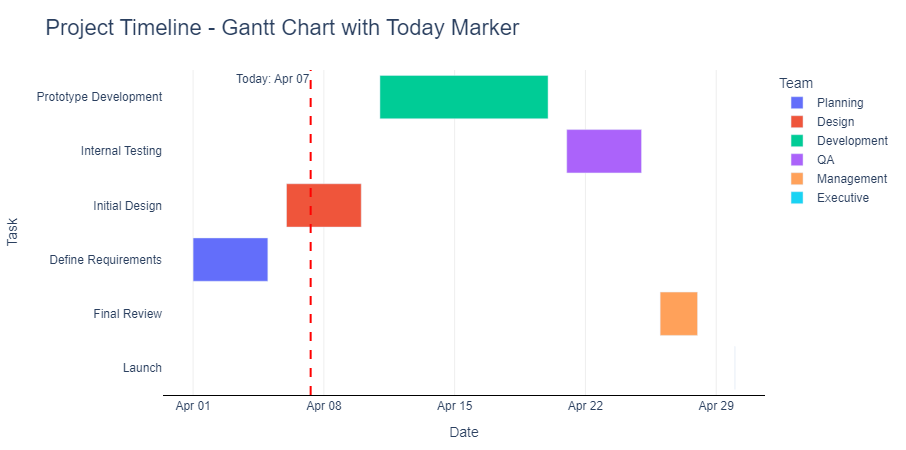
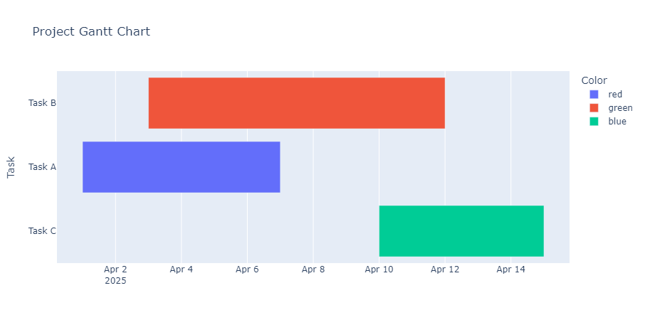

## Gantt-chart

#  Interactive Gantt Chart with Python

 

##  Overview
A Python-generated **interactive Gantt chart** built with `plotly.express` for project timeline visualization. Perfect for tracking tasks, deadlines, and progress in software development, construction, event planning, and more.
Feature	Detail
📛 Inventor	Henry L. Gantt
🕰️ Introduced	~1910s
📊 Purpose	Visualize task durations and timelines
📚 Standards	Supported by PMBOK, PRINCE2, ISO 21500

##  Features
- **Visual task scheduling** with start/end dates
- **Color-coded teams/tasks** for quick identification
- **Today marker** to track current progress
- **Hover tooltips** showing completion percentage
- **Milestone tracking** (e.g., project launches)
- **Responsive design** works in Jupyter/Web

##  Sample Output
 

## ⚙️ Installation
```bash
pip install plotly pandas
